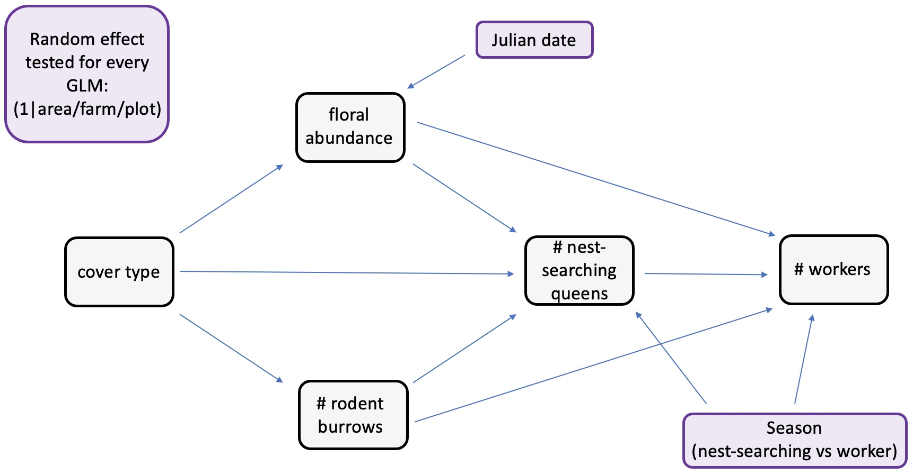
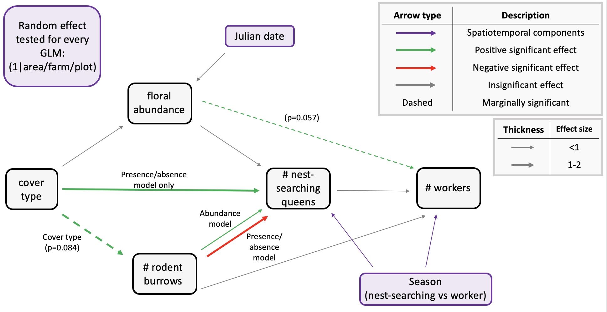

```{r setup, include=FALSE}
knitr::opts_chunk$set(echo = TRUE)
knitr::opts_knit$set(root.dir = "~/Library/CloudStorage/OneDrive-UBC/MSc/12_analysis/rodent-bee-blueberry")
```

# Predicted path diagram



# Load and clean data

```{r}
#load packages
library(tidyverse)   #data manipulation, visualization etc. (dplyr, ggplot2, tidyr)
library(DHARMa)      #diagnostic tools for mixed regression models
library(ordinal)     #models for ordinal outcomes (e.g., cumulative link models)
library(MASS)        #polr
library(glmmTMB)     #fits generalized linear mixed models, including zero-inflated and overdispersed models
library(car)         #tools for regression diagnostics and hypothesis tests
library(emmeans)     #calculates predicted results from models

#read in data
data <- read.csv("06_cleandata/combined_plot_data.csv")

#change character columns to factors
surveys <- data %>%
   mutate(
     site_id = as.factor(site_id),
     round = as.factor(round),
     plot_id = as.factor(plot_id),
     bee_date = as.Date(bee_date),
     bee_season_type = as.factor(bee_season_type),
     area = as.factor(area),
     cover_type = as.factor(cover_type))

#scale continuous predictors
surveys$julian.date_scaled <- as.numeric(scale(surveys$julian.date))
surveys$bare_perc_scaled <- as.numeric(scale(surveys$bare_perc))
surveys$grass_perc_scaled <- as.numeric(scale(surveys$grass_perc))
surveys$forb_perc_scaled <- as.numeric(scale(surveys$forb_perc))
surveys$grass_forb_perc_scaled <- as.numeric(scale(surveys$grass_forb_perc))
surveys$grass_h_scaled <- as.numeric(scale(surveys$grass_h))
surveys$forb_h_scaled <- as.numeric(scale(surveys$forb_h))
surveys$floral_perc_scaled <- as.numeric(scale(surveys$floral_perc))
surveys$grass_forb_floral_perc_scaled <- as.numeric(scale(surveys$grass_forb_floral_perc))
surveys$bombus_floral_perc_scaled <- as.numeric(scale(surveys$bombus_floral_perc))
surveys$flood_perc_scaled <- as.numeric(scale(surveys$flood_perc))
surveys$dry_root_perc_scaled <- as.numeric(scale(surveys$dry_root_perc))
surveys$bryo_perc_scaled <- as.numeric(scale(surveys$bryo_perc))
surveys$bare_flood_dry_bryo_perc_scaled <- as.numeric(scale(surveys$bare_flood_dry_bryo_perc))
surveys$floral_richness_scaled <- as.numeric(scale(surveys$floral_richness))
surveys$bombus_floral_richness_scaled <- as.numeric(scale(surveys$bombus_floral_richness))
surveys$bombus_floral_abun_scaled <- as.numeric(scale(surveys$bombus_floral_abun))
surveys$bombus_floral_abun_nv_scaled <- as.numeric(scale(surveys$bombus_floral_abun_nv))
surveys$nest_searching_queens_scaled <- as.numeric(scale(surveys$nest_searching_queens))
surveys$workers_scaled <- as.numeric(scale(surveys$workers))
surveys$forage_vaco_scaled <- as.numeric(scale(surveys$forage_vaco))
surveys$num_burrows_scaled <- as.numeric(scale(surveys$num_burrows))
surveys$num_active_burrows_scaled <- as.numeric(scale(surveys$num_active_burrows))
surveys$num_inactive_burrows_scaled <- as.numeric(scale(surveys$num_inactive_burrows))
surveys$num_active_dm_scaled <- as.numeric(scale(surveys$num_active_dm))
surveys$num_dm_size_scaled <- as.numeric(scale(surveys$num_dm_size))
surveys$num_inactive_dm_scaled <- as.numeric(scale(surveys$num_inactive_dm))
surveys$prop_inactive_burrows_scaled <- as.numeric(scale(surveys$prop_inactive_burrows))
surveys$num_runway_burrows_scaled <- as.numeric(scale(surveys$num_runway_burrows))

#filter to only include field data
field_data <- surveys %>%
  filter(plot_id != "d")
```

# Rodent burrows vs field management (%grass+forb)

Since the number of rodent burrows was count data, I knew I had to use either a poisson or negative binomial GLM family. I started with the simplest family (poisson) first. I didn't include julian.date as a covariate in this model since I assumed that the number of rodent burrows remains relatively consistent over the course of a season (hence why I only sampled each farm once).

## Steps

1)  Try different random effect structures in the poisson. Compare alternative random effect structures using maximum likelihood (ML) via AIC. I did not include plot as a random effect structure since there was only one observation per plot for rodent burrow data.

-   best fit = 1\|site_id –\> **area not included**

```{r}
burrows_full <- glmmTMB(num_burrows ~ grass_forb_perc_scaled + 
                             (1|area/site_id),
                           family = poisson, 
                           data = field_data)

burrows_siteOnly <- glmmTMB(num_burrows ~ grass_forb_perc_scaled + 
                             (1|site_id),
                           family = poisson, 
                           data = field_data)

burrows_areaOnly <- glmmTMB(num_burrows ~ grass_forb_perc_scaled + 
                             (1|area),
                           family = poisson, 
                           data = field_data)


#compare models using maximum likelihood test
anova(burrows_full, burrows_siteOnly, burrows_areaOnly)

##results tells us the burrows_siteOnly is best model (lowest AIC)
```

2)  Check diagnostics of the model using DHARMa package.

-   Combined adjusted quantile test significant

```{r}
#simulate residuals
residuals_burrows_siteOnly <- simulateResiduals(fittedModel = burrows_siteOnly, plot = TRUE)
```

3)  Try negative binomial instead and check diagnostics.

-   Combined adjusted quantile test still significant.

```{r}
burrows_siteOnly_negBin <- glmmTMB(num_burrows ~ grass_forb_perc_scaled + 
                             (1|site_id),
                           family = nbinom2, 
                           data = field_data)

#simulate residuals
residuals_burrows_siteOnly_negBin <- simulateResiduals(fittedModel = burrows_siteOnly_negBin, plot = TRUE)
```

4)  Try zero-inflated poisson and check diagnostics.

-   combined adjusted quantile test still significant.

```{r}
burrows_zi_pois <- glmmTMB(num_burrows ~ grass_forb_perc_scaled + 
                             (1|site_id),
                           ziformula = ~ grass_forb_perc_scaled + 
                             (1|site_id),
                           family = poisson, 
                           data = field_data)

#simulate residuals
residuals_burrows_zi <- simulateResiduals(fittedModel = burrows_zi_pois, plot = TRUE)
```

5)  Try zero-inflated negative binomial and check diagnostics.

-   combined adjusted quantile test still significant.

```{r}
burrows_zi_nbin <- glmmTMB(num_burrows ~ grass_forb_perc_scaled + 
                             (1|site_id),
                           ziformula = ~ grass_forb_perc_scaled + 
                             (1|site_id),
                           family = nbinom2, 
                           data = field_data)

#simulate residuals
residuals_burrows_zi_nbin <- simulateResiduals(fittedModel = burrows_zi_nbin, plot = TRUE)
#signficant KS test and combined adjusted quantile test
```

6)  Stick with poisson but try using categorical cover_type as predictor instead of % grass/forb cover and try different random effect structures.

-   models using continuous percent grass/forb cover as a predictor showed poor fit and significant residual patterns, likely due to the small sample size (n = 24). Because sites were grouped into two distinct habitat types—grassy plots with high vegetation cover and bare plots with little or no cover—the variable was reclassified as a categorical factor (“grass” vs. “bare”). This simplified model structure improved residual diagnostics and provided a clearer ecological interpretation of differences in burrow abundance between habitat types.

```{r}
burrows_cover_full <- glmmTMB(num_burrows ~ cover_type + 
                             (1|area/site_id),
                           family = poisson, 
                           data = field_data)

burrows_cover_siteOnly <- glmmTMB(num_burrows ~ cover_type + 
                             (1|site_id),
                           family = poisson, 
                           data = field_data)

burrows_cover_areaOnly <- glmmTMB(num_burrows ~ cover_type + 
                             (1|area),
                           family = poisson, 
                           data = field_data)


#compare models using maximum likelihood test
anova(burrows_cover_full, burrows_cover_siteOnly, burrows_cover_areaOnly)

##full model is best (lowest AIC)
```

7.  Check diagnostics

-   significant within-group deviations from uniformity

```{r}

#simulate residuals
residuals_burrows_cover_full <- simulateResiduals(fittedModel = burrows_cover_full, plot = TRUE)
```

8.  Try simpler random effect structure (site-only) and re-check diagnostics

-   No significant problems detected.

```{r}
#simulate residuals
residuals_burrows_cover_siteOnly <- simulateResiduals(fittedModel = burrows_cover_siteOnly, plot = TRUE)
```

9.  Plot results

```{r}
summary(burrows_cover_siteOnly)
```

## Plots

Number of rodent burrows vs cover type

```{r}
#create new data grid
rodent_data_cover<- expand.grid(
  grass_forb_perc_scaled = mean(field_data$grass_forb_perc_scaled, na.rm = TRUE),
  cover_type = unique(field_data$cover_type),
  julian.date_scaled = mean(field_data$julian.date_scaled, na.rm = TRUE)
)

# Get predicted probabilities and standard errors
pred_rodent_cover <- predict(burrows_cover_siteOnly,
                            newdata = rodent_data_cover,
                            se.fit = TRUE,
                            re.form = NA)

# Combine predictions with data frame
pred_rodent_cover_df <- cbind(rodent_data_cover,
                 fit = pred_rodent_cover$fit,
                 se = pred_rodent_cover$se.fit)

ggplot(pred_rodent_cover_df, aes(x = cover_type, y = fit)) +
  geom_point(size = 3) +
  geom_errorbar(aes(ymin = fit - 1.96*se, ymax = fit + 1.96*se), width = 0.2, position = position_dodge(0.6)) +
  labs(title = "Model Predictions (Log-scale)",
       x = "Cover Type",
       y = "Predicted burrow count (log-scale)") +
  theme_classic()
```

## Findings

Neither grass + forb % nor julian date had significant effects on rodent burrow abundance. However, cover type showed a marginally insignificant trend (p=0.0839), where grassy sites had a higher abundance of burrows.

# Floral abundance vs field management (%grass+forb)

Use cumulative link model aka ordinal logistic regression because bombus-relevant floral abundance has:

-   discrete levels (0-5 scale) representing binned counts of blooms

-   ordered categories (higher numbers represent more blooms)

-   unequal intervals between categories

## Steps

1)  Tried running CLM with different random effect structures (full = 1\|area/site/plot) then compared AIC values to determine best model.

-   determined that model without random effect had best fit

```{r}
floral_full <- clmm(as.factor(bombus_floral_abun) ~ cover_type +
                         julian.date_scaled + 
                         (1|area/site_id/plot_id),
                       link = "logit", 
                       data = field_data)

floral_noArea <- clmm(as.factor(bombus_floral_abun) ~ cover_type +
                         julian.date_scaled + 
                         (1|site_id/plot_id),
                       link = "logit", 
                       data = field_data)

#floral_plotOnly <- clmm(as.factor(bombus_floral_abun) ~ cover_type +
 #                        julian.date_scaled + 
  #                       (1|plot_id),
   #                    link = "logit", 
    #                   data = field_data)
##can't use since there are only 2 levels

floral_siteOnly <- clmm(as.factor(bombus_floral_abun) ~ cover_type +
                         julian.date_scaled + 
                         (1|site_id),
                       link = "logit", 
                       data = field_data)

floral_AreaPlot <- clmm(as.factor(bombus_floral_abun) ~ cover_type +
                         julian.date_scaled + 
                         (1|area/plot_id),
                       link = "logit", 
                       data = field_data)
floral_noRE <- polr(as.factor(bombus_floral_abun) ~ cover_type +
                         julian.date_scaled,
                       method = "logistic", 
                       data = field_data)

#compare models AIC
AIC(floral_full, floral_noArea, floral_siteOnly, floral_AreaPlot, floral_noRE)
##shows that model without random effect has best fit
```

2.  Run final model and look at output

```{r}
summary(floral_noRE)
```

## Plots

Vegetation

```{r}
# Get predicted response for cover_type, holding other variables at their means 
pred_floral_veg <- emmeans(
  floral_noRE,
  ~ cover_type,
  at = list(julian.date_scaled = mean(surveys$julian.date_scaled, na.rm=TRUE)), 
  type = "response")

# Convert to dataframe for plotting
pred_floral_veg_df <- as.data.frame(pred_floral_veg)

#plot
ggplot(pred_floral_veg_df, aes(x = cover_type, y = response)) +
  geom_point(size = 3) +
  geom_errorbar(aes(ymin = asymp.LCL, ymax = asymp.UCL), width = 0.2) +
  labs(
    title = "Predicted Floral Abundance by Cover Type",
    x = "Cover Type",
    y = "Predicted Floral Abundance"
  ) +
  theme_classic()
```

Julian date

```{r}
# Define a sequence of values for grass_forb_perc_scaled across its observed range
date_seq <- seq(
  from = min(field_data$julian.date_scaled, na.rm = TRUE),
  to = max(field_data$julian.date_scaled, na.rm = TRUE),
  length.out = 50
)

# Get predicted response for grass_forb_perc_scaled, holding other variables at their means
pred_floral_date <- emmeans(floral_noRE,
               ~ julian.date_scaled,
               at = list(julian.date_scaled = date_seq,
                         cover_type = "grass"),
               type = "response")

# Convert to dataframe for plotting
pred_floral_date_df <- as.data.frame(pred_floral_date)

ggplot(pred_floral_date_df, aes(x = julian.date_scaled, y = response)) +
  geom_line(size = 1) +
  geom_ribbon(aes(ymin = asymp.LCL, ymax = asymp.UCL), alpha = 0.2, color = NA) +
  labs(title = "Predicted Floral Abundance vs Julian Date",
       x = "Julian Date (scaled)",
       y = "Predicted Floral Abundance") +
  theme_classic()
```

## Findings

No significant effect of either grass+ forb% or julian date.

# Number of nest-searching queens vs flowers, rodents, and field management technique

Start by plotting a zero-inflated poisson, since \# of nest-searching queens is count data with a lot of zeros. I added bee_season_type as a covariate, since during my exploratory data analyses I saw that there was only a significant different in nest-searching queens among grassy vs bare sites during nesting season.

## Steps

1.  Try multiple random effects structures

-   best fit = no random effect

```{r}
NSQ_full <- glmmTMB(nest_searching_queens ~ cover_type + 
                      bombus_floral_abun_scaled + 
                      num_burrows_scaled + 
                      bee_season_type + 
                      (1|area/site_id/plot_id),
                    ziformula = ~ cover_type + 
                      bombus_floral_abun_scaled + 
                      num_burrows_scaled + 
                      bee_season_type +
                      (1|area/site_id/plot_id),
                    family = poisson, 
                    data = field_data)


NSQ_noArea <- glmmTMB(nest_searching_queens ~ cover_type + 
                        bombus_floral_abun_scaled + 
                        num_burrows_scaled + 
                        bee_season_type + 
                        (1|site_id/plot_id),
                      ziformula = ~ cover_type + 
                        bombus_floral_abun_scaled + 
                        num_burrows_scaled + 
                        bee_season_type +
                        (1|site_id/plot_id),
                      family = poisson, 
                      data = field_data)

NSQ_plotOnly <-  glmmTMB(nest_searching_queens ~ cover_type + 
                        bombus_floral_abun_scaled + 
                        num_burrows_scaled + 
                        bee_season_type + 
                        (1|plot_id),
                      ziformula = ~ cover_type + 
                        bombus_floral_abun_scaled + 
                        num_burrows_scaled + 
                        bee_season_type +
                        (1|plot_id),
                      family = poisson, 
                      data = field_data)

NSQ_siteOnly <- glmmTMB(nest_searching_queens ~ cover_type + 
                        bombus_floral_abun_scaled + 
                        num_burrows_scaled + 
                        bee_season_type + 
                        (1|site_id),
                      ziformula = ~ cover_type + 
                        bombus_floral_abun_scaled + 
                        num_burrows_scaled + 
                        bee_season_type +
                        (1|site_id),
                      family = poisson, 
                      data = field_data)

NSQ_AreaPlot <-  glmmTMB(nest_searching_queens ~ cover_type + 
                        bombus_floral_abun_scaled + 
                        num_burrows_scaled + 
                        bee_season_type + 
                        (1|area/plot_id),
                      ziformula = ~ cover_type + 
                        bombus_floral_abun_scaled + 
                        num_burrows_scaled + 
                        bee_season_type +
                        (1|area/plot_id),
                      family = poisson, 
                      data = field_data)

NSQ_noRE <- glmmTMB(nest_searching_queens ~ cover_type + 
                    bombus_floral_abun_scaled + 
                    num_burrows_scaled + 
                    bee_season_type, 
                  ziformula = ~ cover_type + 
                    bombus_floral_abun_scaled + 
                    num_burrows_scaled + 
                    bee_season_type,  # zero-inflation model
                  family = poisson, #poisson
                  data = field_data)

#compare models using maximum likelihood test
anova(NSQ_full, NSQ_noArea, NSQ_plotOnly, NSQ_siteOnly, NSQ_AreaPlot, NSQ_noRE)

##results tells us the model without random effects is best (lowest AIC). 
```

2.  Check diagnostics of best model.

-   No significant problems detected.

```{r}
residuals_nsq_noRE <- simulateResiduals(fittedModel =NSQ_noRE, plot = TRUE)
##looks good
```

3.  Look at results

```{r}
summary(NSQ_noRE)
```

## Plots

Number of nest-searching queens vs grass/forb

Conditional model:

```{r}
#create new data grid
nsq_data_cover<- expand.grid(
  cover_type = unique(field_data$cover_type),
  bombus_floral_abun_scaled = mean(field_data$bombus_floral_abun_scaled),
  num_burrows_scaled = mean(field_data$num_burrows_scaled),
  bee_season_type = "nestsearching"
)

# Predictions for conditional model (count)
pred_nsq_cover_cond <- predict(NSQ_noRE,
                            newdata = nsq_data_cover,
                            type = "conditional",
                            se.fit = TRUE)

# Predictions for zero-inflated model 
pred_nsq_cover_zi <- predict(NSQ_noRE,
                            newdata = nsq_data_cover,
                            type = "zprob",
                            se.fit = TRUE)

# Combine predictions with data frame
pred_nsq_cover_df <- cbind(nsq_data_cover,
                 cond_fit = pred_nsq_cover_cond$fit,
                 cond_se = pred_nsq_cover_cond$se.fit,
                 zi_fit = pred_nsq_cover_zi$fit,
                 zi_se = pred_nsq_cover_zi$se.fit)

#plot
ggplot(pred_nsq_cover_df, aes(x = cover_type, y = cond_fit)) +
  geom_point(size = 3) +
  geom_errorbar(aes(ymin = cond_fit - 1.96*cond_se, ymax = cond_fit + 1.96*cond_se), width = 0.2, position = position_dodge(0.6)) +
  labs(title = "Model Predictions (Log-scale)",
       x = "Cover Type",
       y = "Predicted NSQ count (log-scale)") +
  theme_classic()
```

Zero-inflated model:

```{r}
# Plot zi predictions
ggplot(pred_nsq_cover_df, aes(x = cover_type, y = zi_fit)) +
  geom_point(size = 3) +
  geom_errorbar(aes(ymin = zi_fit - 1.96*zi_se, ymax = zi_fit + 1.96*zi_se), width = 0.2, position = position_dodge(0.6)) +
  labs(title = "Zero-inflation Model Predictions (NSQ Presence/absence)", y = "Predicted Probability of Structural Zero") +
  theme_classic()
```

Number of nest-searching queens vs floral abundance

Conditional model:

```{r}
# Define a sequence of values for bombus_floral_abun_scaled across its observed range
floral_seq <- seq(
  from = min(field_data$bombus_floral_abun_scaled, na.rm = TRUE),
  to = max(field_data$bombus_floral_abun_scaled, na.rm = TRUE),
  length.out = 50
)

# Create data grid over bombus_floral_abun_scaled
nsq_data_floral <- data.frame(
  bombus_floral_abun_scaled = floral_seq,
  cover_type = "grass",
  num_burrows_scaled = mean(field_data$num_burrows_scaled),
  bee_season_type = "nestsearching"  
)

# Predictions for conditional model (count)
pred_nsq_floral_cond <- predict(NSQ_noRE, newdata = nsq_data_floral, type = "conditional", se.fit = TRUE)

# Predictions for zero-inflation model
pred_nsq_floral_zi <- predict(NSQ_noRE, newdata = nsq_data_floral, type = "zprob", se.fit = TRUE)

# Combine predictions with newdata
pred_nsq_floral_df <- cbind(nsq_data_floral,
                 cond_fit = pred_nsq_floral_cond$fit,
                 cond_se = pred_nsq_floral_cond$se.fit,
                 zi_fit = pred_nsq_floral_zi$fit,
                 zi_se = pred_nsq_floral_zi$se.fit)

# Plot conditional predictions
ggplot(pred_nsq_floral_df, aes(x = bombus_floral_abun_scaled, y = cond_fit)) +
  geom_line(color = "blue") +
  geom_ribbon(aes(ymin = cond_fit - 1.96*cond_se, ymax = cond_fit + 1.96*cond_se), alpha = 0.2) +
  labs(title = "Conditional Model Predictions (log-scale)", y = "Predicted NSQ count (log-scale)") +
  theme_classic()

```

Zero-inflated model:

```{r}
# Plot zi predictions
ggplot(pred_nsq_floral_df, aes(x = bombus_floral_abun_scaled, y = zi_fit)) +
  geom_line(color = "blue") +
  geom_ribbon(aes(ymin = zi_fit - 1.96*zi_se, ymax = zi_fit + 1.96*zi_se), alpha = 0.2) +
  labs(title = "Zero-inflation Model Predictions (NSQ Presence/Absence)", y = "Predicted Probability of Structural Zero") +
  theme_classic()

```

Number of nest-searching queens vs number of rodent burrows

Conditional model:

```{r}
# Create data grid over rodent_burrows_scaled
nsq_data_rodent <- data.frame(
  num_burrows_scaled = seq(min(field_data$num_burrows_scaled), max(field_data$num_burrows_scaled), length.out = 50),
  cover_type = "grass",
  bombus_floral_abun_scaled = mean(field_data$bombus_floral_abun_scaled),
  bee_season_type = "nestsearching"  
)

# Predictions for conditional model (count)
pred_nsq_rodent_cond <- predict(NSQ_noRE, newdata = nsq_data_rodent, type = "conditional", se.fit = TRUE)

# Predictions for zero-inflation model
pred_nsq_rodent_zi <- predict(NSQ_noRE, newdata = nsq_data_rodent, type = "zprob", se.fit = TRUE)

# Combine predictions with newdata
pred_nsq_rodent_df <- cbind(nsq_data_rodent,
                 cond_fit = pred_nsq_rodent_cond$fit,
                 cond_se = pred_nsq_rodent_cond$se.fit,
                 zi_fit = pred_nsq_rodent_zi$fit,
                 zi_se = pred_nsq_rodent_zi$se.fit)

# Plot conditional predictions
ggplot(pred_nsq_rodent_df, aes(x = num_burrows_scaled, y = cond_fit)) +
  geom_line(color = "blue") +
  geom_ribbon(aes(ymin = cond_fit - 1.96*cond_se, ymax = cond_fit + 1.96*cond_se), alpha = 0.2) +
  labs(title = "Conditional Model Predictions (Log-scale)", y = "Predicted NSQ count (log-scale)") +
  theme_classic()
```

Zero-inflated model:

```{r}
ggplot(pred_nsq_rodent_df, aes(x = num_burrows_scaled, y = zi_fit)) +
  geom_line(color = "blue") +
  geom_ribbon(aes(ymin = zi_fit - 1.96*zi_se, ymax = zi_fit + 1.96*zi_se), alpha = 0.2) +
  labs(title = "Zero-inflation Model Predictions (NSQ Presence/Absence)", y = "Predicted Probability of Structural Zero") +
  theme_classic()
```

Number of nest-searching queens vs season type

Conditional model:

```{r}
# Create newdata with discrete factor levels for bee_season_type
nsq_data_season <- data.frame(
  cover_type = "grass",
  bombus_floral_abun_scaled = mean(field_data$bombus_floral_abun_scaled),
  num_burrows_scaled = mean(field_data$num_burrows_scaled),
  bee_season_type = factor(c("nestsearching", "worker"), levels = levels(field_data$bee_season_type))
)

# Predictions for conditional model (count)
pred_nsq_season_cond <- predict(NSQ_noRE, newdata = nsq_data_season, type = "conditional", se.fit = TRUE)

# Predictions for zero-inflation model
pred_nsq_season_zi <- predict(NSQ_noRE, newdata = nsq_data_season, type = "zprob", se.fit = TRUE)

# Combine predictions with newdata
pred_nsq_season_df <- cbind(nsq_data_season,
                 cond_fit = pred_nsq_season_cond$fit,
                 cond_se = pred_nsq_season_cond$se.fit,
                 zi_fit = pred_nsq_season_zi$fit,
                 zi_se = pred_nsq_season_zi$se.fit)

# Plot conditional predictions
ggplot(pred_nsq_season_df, aes(x = bee_season_type, y = cond_fit)) +
  geom_point(size=3) +
  geom_errorbar(aes(ymin = cond_fit - 1.96*cond_se, ymax = cond_fit + 1.96*cond_se), width = 0.2, position = position_dodge(0.6))+
  labs(title = "Conditional Model Predictions (Log-scale)", y = "Predicted NSQ count (log-scale)") +
  theme_classic()
```

Zero-inflated model:

```{r}
ggplot(pred_nsq_season_df, aes(x = bee_season_type, y = zi_fit)) +
  geom_point(size=3) +
  geom_errorbar(aes(ymin = zi_fit - 1.96*zi_se, ymax = zi_fit + 1.96*zi_se), width = 0.2, position = position_dodge(0.6))+
  labs(title = "Zero-inflation Model Predictions (Presence/Absence)", y = "Predicted Probability of Structural Zero") +
  theme_classic()
```

## Findings

In conditional model (modelling abundance of nest-searching queens):

-   no significant effect of grass+forb%, floral abundance, bee season

-   significant positive effect of number of burrows

In zero-inflation model (modelling presence/absence of nest-searching queens):

-   no significant effect of floral abundance

-   Significant effect of grass+forb% (less likely to be absent with more grass/forb), number of burrows (more likely to be absent with more burrows), bee season (more likely to be absent during worker season than nest-searching season).

Interestingly, the number of rodent burrows is associated with more bombus nest-searching in the conditional model, but the number of rodent burrows is associated with more structural zeros in the zero-inflation model. This means that if a site is suitable for nesting, more rodent burrows is associated with more bombus nest-searching. However, in some cases, rodent burrows may signal inhospitable habitat conditions for bumble bees.

# Number of workers vs nest-searching queens, floral abundance, rodent burrows.

Go through similar model selection steps as for the rodent burrow model.

## Steps

1)  Check different random effects structures

-   best fit = 1\|site_id/plot_id –\> **area not included**

```{r}
workers_full <- glmmTMB(workers ~ nest_searching_queens_scaled +
                       bombus_floral_abun_scaled + 
                       num_burrows_scaled + 
                       bee_season_type +
                         (1|area/site_id/plot_id), 
                     family = poisson,
                     data = field_data
                       )


workers_noArea <- glmmTMB(workers ~ nest_searching_queens_scaled +
                       bombus_floral_abun_scaled + 
                       num_burrows_scaled + 
                       bee_season_type+
                         (1|site_id/plot_id), 
                     family = poisson,
                     data = field_data
                       )

workers_plotOnly <-  glmmTMB(workers ~ nest_searching_queens_scaled +
                       bombus_floral_abun_scaled + 
                       num_burrows_scaled + 
                       bee_season_type+
                         (1|plot_id), 
                     family = poisson,
                     data = field_data
                       )

workers_siteOnly <- glmmTMB(workers ~ nest_searching_queens_scaled +
                       bombus_floral_abun_scaled + 
                       num_burrows_scaled + 
                       bee_season_type+
                         (1|site_id), 
                     family = poisson,
                     data = field_data
                       )

workers_AreaPlot <-  glmmTMB(workers ~ nest_searching_queens_scaled +
                       bombus_floral_abun_scaled + 
                       num_burrows_scaled + 
                       bee_season_type+
                         (1|area/plot_id), 
                     family = poisson,
                     data = field_data
                       )

workers_noRE <- glmmTMB(workers ~ nest_searching_queens_scaled +
                       bombus_floral_abun_scaled + 
                       num_burrows_scaled + 
                       bee_season_type, 
                     family = poisson,
                     data = field_data
                       )

#compare models using maximum likelihood test
anova(workers_full, workers_noArea, workers_plotOnly, workers_siteOnly, workers_AreaPlot, workers_noRE)

##results tells us the model with no area is best (lowest AIC). 
```

2.  Check diagnostics of best model.

-   Residual plots show that there are no significant issues with model fit. Check to see if negative binomial straightens lines in residual plot.

```{r}
#simulate residuals
residuals_workers_noArea <- simulateResiduals(fittedModel = workers_noArea, plot = TRUE)
```

3.  Plot negative binomial and check diagnostics.

-   Residual plot shows better fit (straighter horizontal lines). AIC is also lower for negative binomial. This shows that the negative binomial is a better fit.

```{r}
worker_negbin <- glmmTMB(workers ~ nest_searching_queens_scaled +
                       bombus_floral_abun_scaled + 
                       num_burrows_scaled + 
                       bee_season_type +
                         (1|site_id/plot_id), 
                     family = nbinom2,
                     data = field_data
                       )

residuals_workers_negbin <- simulateResiduals(fittedModel = worker_negbin, plot = TRUE)

anova(workers_noArea, worker_negbin)
##negative binomial is better (lower AIC)
```

4.  Check results of final model

```{r}
summary(worker_negbin)
```

## Plots

Number of workers vs number of nest-searching queens

```{r}
# Define a sequence of values for nsq across its observed range
queen_seq <- seq(
  from = min(field_data$nest_searching_queens_scaled, na.rm = TRUE),
  to = max(field_data$nest_searching_queens_scaled, na.rm = TRUE),
  length.out = 50
)

#create new data grid
worker_data_nsq<- expand.grid(
  nest_searching_queens_scaled = queen_seq,
  bombus_floral_abun_scaled = mean(field_data$bombus_floral_abun_scaled, na.rm = TRUE),
  num_burrows_scaled = mean(field_data$num_burrows_scaled, na.rm = TRUE),
  bee_season_type = "worker"
)

# Get predicted probabilities and standard errors
pred_worker_nsq <- predict(worker_negbin,
                            newdata = worker_data_nsq,
                            se.fit = TRUE,
                            re.form = NA)

# Combine predictions with data frame
pred_worker_nsq_df <- cbind(worker_data_nsq,
                 fit = pred_worker_nsq$fit,
                 se = pred_worker_nsq$se.fit)

ggplot(pred_worker_nsq_df, aes(x = nest_searching_queens_scaled, y = fit)) +
  geom_line(size = 1) +
  geom_ribbon(aes(ymin = fit - 1.96*se, ymax = fit + 1.96*se), alpha = 0.2) +
  labs(title = "Model Predictions (Log-scale)",
       x = "Nest-searching queen abundance (scaled)",
       y = "Predicted worker count (log-scale)") +
  theme_classic()
```

Number of workers vs floral abundance

```{r}
#create new data grid
worker_data_floral<- expand.grid(
  nest_searching_queens_scaled = mean(field_data$nest_searching_queens_scaled, na.rm = TRUE),
  bombus_floral_abun_scaled = floral_seq,
  num_burrows_scaled = mean(field_data$num_burrows_scaled, na.rm = TRUE),
  bee_season_type = "worker"
)

# Get predicted probabilities and standard errors
pred_worker_floral <- predict(worker_negbin,
                            newdata = worker_data_floral,
                            se.fit = TRUE,
                            re.form = NA)

# Combine predictions with data frame
pred_worker_floral_df <- cbind(worker_data_floral,
                 fit = pred_worker_floral$fit,
                 se = pred_worker_floral$se.fit)

ggplot(pred_worker_floral_df, aes(x = bombus_floral_abun_scaled, y = fit)) +
  geom_line(size = 1) +
  geom_ribbon(aes(ymin = fit - 1.96*se, ymax = fit + 1.96*se), alpha = 0.2) +
  labs(title = "Model Predictions (Log-scale)",
       x = "Floral abundance (scaled)",
       y = "Predicted worker count (log-scale)") +
  theme_classic()
```

Number of workers vs number of rodent burrows

```{r}
# Define a sequence of values for rodent burrows across its observed range
rodent_seq <- seq(
  from = min(field_data$num_burrows_scaled, na.rm = TRUE),
  to = max(field_data$num_burrows_scaled, na.rm = TRUE),
  length.out = 50)

#create new data grid
worker_data_rodent<- expand.grid(
  nest_searching_queens_scaled = mean(field_data$nest_searching_queens_scaled, na.rm = TRUE),
  bombus_floral_abun_scaled = mean(field_data$bombus_floral_abun_scaled, na.rm = TRUE),
  num_burrows_scaled =rodent_seq,
  bee_season_type = "worker"
)

# Get predicted probabilities and standard errors
pred_worker_rodent <- predict(worker_negbin,
                            newdata = worker_data_rodent,
                            se.fit = TRUE,
                            re.form = NA)

# Combine predictions with data frame
pred_worker_rodent_df <- cbind(worker_data_rodent,
                 fit = pred_worker_rodent$fit,
                 se = pred_worker_rodent$se.fit)

ggplot(pred_worker_rodent_df, aes(x = num_burrows_scaled, y = fit)) +
  geom_line(size = 1) +
  geom_ribbon(aes(ymin = fit - 1.96*se, ymax = fit + 1.96*se), alpha = 0.2) +
  labs(title = "Model Predictions (Log-scale)",
       x = "Rodent burrow abundance (scaled)",
       y = "Predicted worker count (log-scale)") +
  theme_classic()
```

Number of workers vs season

```{r}
#create new data grid
worker_data_season<- expand.grid(
  nest_searching_queens_scaled = mean(field_data$nest_searching_queens_scaled, na.rm = TRUE),
  bombus_floral_abun_scaled = mean(field_data$bombus_floral_abun_scaled, na.rm = TRUE),
  num_burrows_scaled = mean(field_data$num_burrows_scaled, na.rm = TRUE),
  bee_season_type = unique(field_data$bee_season_type)
)

# Get predicted probabilities and standard errors
pred_worker_season <- predict(worker_negbin,
                            newdata = worker_data_season,
                            se.fit = TRUE,
                            re.form = NA)

# Combine predictions with data frame
pred_worker_season_df <- cbind(worker_data_season,
                 fit = pred_worker_season$fit,
                 se = pred_worker_season$se.fit)

ggplot(pred_worker_season_df, aes(x = bee_season_type, y = fit)) +
  geom_point(size = 3) +
  geom_errorbar(aes(ymin = fit - 1.96*se, ymax = fit + 1.96*se), 
                width = 0.2, position = position_dodge(0.6)) +
  labs(title = "Model Predictions (Log-scale)",
       x = "Bee season",
       y = "Predicted worker count (log-scale)") +
  theme_classic()
```

## Findings

Number of nest-searching queens and number of rodent burrows is does not significantly effect number of workers. Significantly more workers during worker season than during nest-searching season. Marginally insignificant (p=0.0573) positive effect of bombus-relevant floral abundance on worker abundance.

# Final Path Diagram


