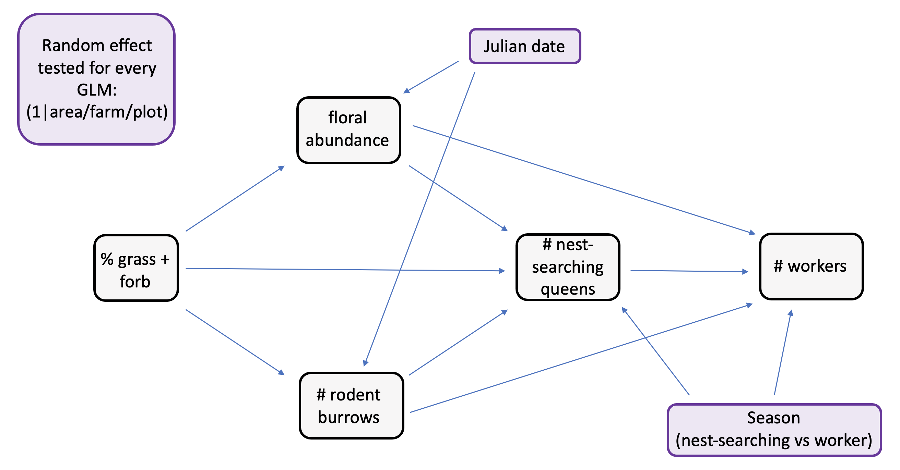
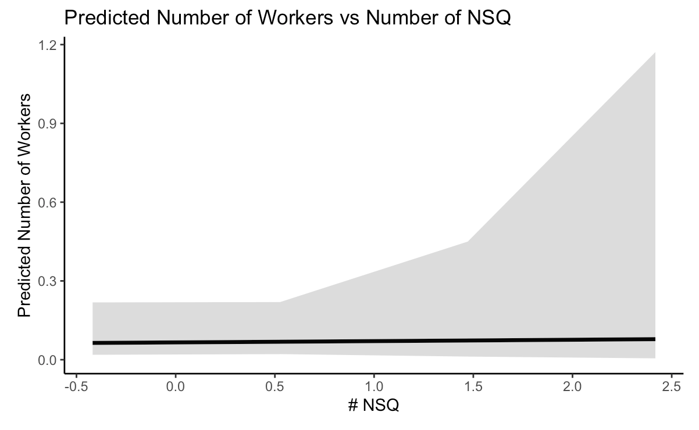
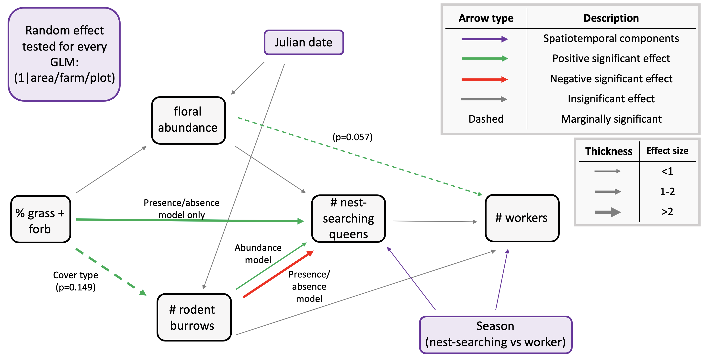

```{r setup, include=FALSE}
knitr::opts_chunk$set(echo = TRUE)
knitr::opts_knit$set(root.dir = "~/Library/CloudStorage/OneDrive-UBC/MSc/12_analysis/rodent-bee-blueberry")
```

# Predicted path diagram



# Load and clean data

```{r}
#load packages
library(tidyverse)
library(DHARMa)
library(ordinal)
library(MASS)
library(glmmTMB)
library(ggplot2)
library(ggeffects)
library(car)
library(emmeans)

#read in data
data <- read.csv("06_cleandata/combined_plot_data.csv")

#change character columns to factors
surveys <- data %>%
   mutate(
     site_id = as.factor(site_id),
     round = as.factor(round),
     plot_id = as.factor(plot_id),
     bee_date = as.Date(bee_date),
     bee_season_type = as.factor(bee_season_type),
     area = as.factor(area),
     cover_type = as.factor(cover_type))

#scale continuous predictors
surveys$julian.date_scaled <- as.numeric(scale(surveys$julian.date))
surveys$bare_perc_scaled <- as.numeric(scale(surveys$bare_perc))
surveys$grass_perc_scaled <- as.numeric(scale(surveys$grass_perc))
surveys$forb_perc_scaled <- as.numeric(scale(surveys$forb_perc))
surveys$grass_forb_perc_scaled <- as.numeric(scale(surveys$grass_forb_perc))
surveys$grass_h_scaled <- as.numeric(scale(surveys$grass_h))
surveys$forb_h_scaled <- as.numeric(scale(surveys$forb_h))
surveys$floral_perc_scaled <- as.numeric(scale(surveys$floral_perc))
surveys$grass_forb_floral_perc_scaled <- as.numeric(scale(surveys$grass_forb_floral_perc))
surveys$bombus_floral_perc_scaled <- as.numeric(scale(surveys$bombus_floral_perc))
surveys$flood_perc_scaled <- as.numeric(scale(surveys$flood_perc))
surveys$dry_root_perc_scaled <- as.numeric(scale(surveys$dry_root_perc))
surveys$bryo_perc_scaled <- as.numeric(scale(surveys$bryo_perc))
surveys$bare_flood_dry_bryo_perc_scaled <- as.numeric(scale(surveys$bare_flood_dry_bryo_perc))
surveys$floral_richness_scaled <- as.numeric(scale(surveys$floral_richness))
surveys$bombus_floral_richness_scaled <- as.numeric(scale(surveys$bombus_floral_richness))
surveys$bombus_floral_abun_scaled <- as.numeric(scale(surveys$bombus_floral_abun))
surveys$bombus_floral_abun_nv_scaled <- as.numeric(scale(surveys$bombus_floral_abun_nv))
surveys$nest_searching_queens_scaled <- as.numeric(scale(surveys$nest_searching_queens))
surveys$workers_scaled <- as.numeric(scale(surveys$workers))
surveys$forage_vaco_scaled <- as.numeric(scale(surveys$forage_vaco))
surveys$num_burrows_scaled <- as.numeric(scale(surveys$num_burrows))
surveys$num_active_burrows_scaled <- as.numeric(scale(surveys$num_active_burrows))
surveys$num_inactive_burrows_scaled <- as.numeric(scale(surveys$num_inactive_burrows))
surveys$num_active_dm_scaled <- as.numeric(scale(surveys$num_active_dm))
surveys$num_dm_size_scaled <- as.numeric(scale(surveys$num_dm_size))
surveys$num_inactive_dm_scaled <- as.numeric(scale(surveys$num_inactive_dm))
surveys$prop_inactive_burrows_scaled <- as.numeric(scale(surveys$prop_inactive_burrows))
surveys$num_runway_burrows_scaled <- as.numeric(scale(surveys$num_runway_burrows))

#filter to only include field data
field_data <- surveys %>%
  filter(plot_id != "d")
```

# Floral abundance vs field management (%grass+forb)

Use cumulative link model aka ordinal logistic regression because bombus-relevant floral abundance has:

-   discrete levels (0-5 scale) representing binned counts of blooms

-   ordered categories (higher numbers represent more blooms)

-   unequal intervals between categories

## Steps

1)  Tried running CLM with different random effect structures (full = 1\|area/site/plot) then compared AIC values to determine best model.

-   determined that model without random effect had best fit

```{r}
floral_full <- clmm(as.factor(bombus_floral_abun) ~ grass_forb_perc_scaled +
                         julian.date_scaled + 
                         (1|area/site_id/plot_id),
                       link = "logit", 
                       data = field_data)

floral_noArea <- clmm(as.factor(bombus_floral_abun) ~ grass_forb_perc_scaled +
                         julian.date_scaled + 
                         (1|site_id/plot_id),
                       link = "logit", 
                       data = field_data)

#floral_plotOnly <- clmm(as.factor(bombus_floral_abun) ~ grass_forb_perc_scaled +
 #                        julian.date_scaled + 
  #                       (1|plot_id),
   #                    link = "logit", 
    #                   data = field_data)
##can't use since there are only 2 levels

floral_siteOnly <- clmm(as.factor(bombus_floral_abun) ~ grass_forb_perc_scaled +
                         julian.date_scaled + 
                         (1|site_id),
                       link = "logit", 
                       data = field_data)

floral_AreaPlot <- clmm(as.factor(bombus_floral_abun) ~ grass_forb_perc_scaled +
                         julian.date_scaled + 
                         (1|area/plot_id),
                       link = "logit", 
                       data = field_data)
floral_noRE <- polr(as.factor(bombus_floral_abun) ~ grass_forb_perc_scaled +
                         julian.date_scaled,
                       method = "logistic", 
                       data = field_data)

#compare models AIC
AIC(floral_full, floral_noArea, floral_siteOnly, floral_AreaPlot, floral_noRE)
##shows that model without random effect has best fit
```

2)  Compare AIC between model with and without cover_type as a covariate.

-   determined that model without cover type as covariate was better

```{r}
floral_noRE_cover <- polr(as.factor(bombus_floral_abun) ~ grass_forb_perc_scaled +
                            cover_type +
                         julian.date_scaled,
                       method = "logistic", 
                       data = field_data)

AIC(floral_noRE_cover, floral_noRE)
##not including cover is better
```

3)  Run final model and look at output

```{r}
summary(floral_noRE)
```

## Plots

Vegetation

```{r}
# Define a sequence of values for grass_forb_perc_scaled across its observed range
grass_seq <- seq(
  from = min(surveys$grass_forb_perc_scaled, na.rm = TRUE),
  to = max(surveys$grass_forb_perc_scaled, na.rm = TRUE),
  length.out = 50
)

# Get predicted response for grass_forb_perc_scaled, holding other variables at their means
pred_floral_veg <- emmeans(floral_noRE,
               ~ grass_forb_perc_scaled,
               at = list(grass_forb_perc_scaled = grass_seq,
                         julian.date_scaled = mean(surveys$julian.date_scaled, na.rm=TRUE)),
               type = "response")

# Convert to dataframe for plotting
pred_floral_veg_df <- as.data.frame(pred_floral_veg)

ggplot(pred_floral_veg_df, aes(x = grass_forb_perc_scaled, y = response)) +
  geom_line(size = 1) +
  geom_ribbon(aes(ymin = asymp.LCL, ymax = asymp.UCL), alpha = 0.2, color = NA) +
  labs(title = "Predicted Floral Abundance vs Grass/Forb %",
       x = "Grass and Forb Percentage (scaled)",
       y = "Predicted Floral Abundance") +
  theme_classic()
```

Julian date

```{r}
# Define a sequence of values for grass_forb_perc_scaled across its observed range
date_seq <- seq(
  from = min(surveys$julian.date_scaled, na.rm = TRUE),
  to = max(surveys$julian.date_scaled, na.rm = TRUE),
  length.out = 50
)

# Get predicted response for grass_forb_perc_scaled, holding other variables at their means
pred_floral_date <- emmeans(floral_noRE,
               ~ julian.date_scaled,
               at = list(julian.date_scaled = date_seq,
                         grass_forb_perc_scaled = mean(surveys$grass_forb_perc_scaled, na.rm=TRUE)),
               type = "response")

# Convert to dataframe for plotting
pred_floral_date_df <- as.data.frame(pred_floral_date)

ggplot(pred_floral_date_df, aes(x = julian.date_scaled, y = response)) +
  geom_line(size = 1) +
  geom_ribbon(aes(ymin = asymp.LCL, ymax = asymp.UCL), alpha = 0.2, color = NA) +
  labs(title = "Predicted Floral Abundance vs Julian Date",
       x = "Julian Date (scaled)",
       y = "Predicted Floral Abundance") +
  theme_classic()
```

## Findings

No significant effect of either grass+ forb% or julian date.

# Rodent burrows vs field management (%grass+forb)

Since the number of rodent burrows was count data, I knew I had to use either a poisson or negative binomial GLM family. I started with the simplest family (poisson) first.

## Steps

1)  Try different random effect structures in the poisson. Compare models using likelihood ratio tests to determine best random effect structure.

-   best fit = 1\|site_id/plot_id –\> **area not included**

```{r}
burrows_full <- glmmTMB(num_burrows ~ grass_forb_perc_scaled + 
                             julian.date_scaled + 
                             (1|area/site_id/plot_id),
                           family = poisson, 
                           data = field_data)


burrows_noArea <- glmmTMB(num_burrows ~ grass_forb_perc_scaled + 
                             julian.date_scaled + 
                             (1|site_id/plot_id),
                           family = poisson, 
                           data = field_data)

burrows_plotOnly <- glmmTMB(num_burrows ~ grass_forb_perc_scaled + 
                             julian.date_scaled + 
                             (1|plot_id),
                           family = poisson, 
                           data = field_data)

burrows_siteOnly <- glmmTMB(num_burrows ~ grass_forb_perc_scaled + 
                             julian.date_scaled + 
                             (1|site_id),
                           family = poisson, 
                           data = field_data)

burrows_AreaPlot <- glmmTMB(num_burrows ~ grass_forb_perc_scaled + 
                             julian.date_scaled + 
                             (1|area/plot_id),
                           family = poisson, 
                           data = field_data)


#compare models using maximum likelihood test
anova(burrows_full, burrows_noArea, burrows_plotOnly, burrows_siteOnly, burrows_AreaPlot)

##results tells us the burrows_noArea is best model (lowest AIC)
```

2)  Check diagnostics of the model using DHARMa package.

-   Combined adjusted quantile test significant

```{r}
#simulate residuals
residuals_burrows_noArea <- simulateResiduals(fittedModel = burrows_noArea, plot = TRUE)
```

3)  Try negative binomial instead and check diagnostics.

-   Combined adjusted quantile test still significant.

```{r}
burrows_noArea_negBin <- glmmTMB(num_burrows ~ grass_forb_perc_scaled + 
                             julian.date_scaled + 
                             (1|site_id/plot_id),
                           family = nbinom1, #use nbinom1 since nbinom2 doesn't converge
                           data = field_data)

#simulate residuals
residuals_burrows_noArea_negBin <- simulateResiduals(fittedModel = burrows_noArea_negBin, plot = TRUE)
```

4)  Try zero-inflated poisson and check diagnostics.

-   KS test and combined adjusted quantile test still significant.

```{r}
burrows_zi_pois <- glmmTMB(num_burrows ~ grass_forb_perc_scaled + 
                             julian.date_scaled + 
                             (1|site_id/plot_id),
                           ziformula = ~ grass_forb_perc_scaled + 
                             julian.date_scaled + 
                             (1|site_id/plot_id), # zero-inflation model
                           family = poisson, 
                           data = field_data)

#simulate residuals
residuals_burrows_zi <- simulateResiduals(fittedModel = burrows_zi_pois, plot = TRUE)
```

5)  Try zero-inflated negative binomial and check diagnostics.

-   KS test and combined adjusted quantile test still significant.

```{r}
burrows_zi_nbin <- glmmTMB(num_burrows ~ grass_forb_perc_scaled + 
                             julian.date_scaled + 
                             (1|site_id/plot_id),
                           ziformula = ~ grass_forb_perc_scaled + 
                             julian.date_scaled + 
                             (1|site_id/plot_id), # zero-inflation model
                           family = nbinom2, 
                           data = field_data)

#simulate residuals
residuals_burrows_zi_nbin <- simulateResiduals(fittedModel = burrows_zi_nbin, plot = TRUE)
#signficant KS test and combined adjusted quantile test
```

6)  Stick with poisson but try adding cover_type as an additional covariate and check diagnostics.

-   none of the tests were significant! –\> good to keep this one

```{r}
burrows_pois_cover <- glmmTMB(num_burrows ~ grass_forb_perc_scaled + 
                                         julian.date_scaled +
                                         cover_type + 
                             (1|site_id/plot_id),
                           family = poisson, 
                           data = field_data)

#simulate residuals
residuals_burrows_pois_cover <- simulateResiduals(fittedModel = burrows_pois_cover, plot = TRUE)
```

7.  Plot results

```{r}
summary(burrows_pois_cover)
```

## Plots

Predicted num_burrows vs Grass/Forb %, by Cover Type

```{r}
pred_rodent_veg <- ggpredict(burrows_pois_cover, terms = c("grass_forb_perc_scaled"))

ggplot(pred_rodent_veg, aes(x = x, y = predicted)) +
  geom_line(size = 1.2) +
  geom_ribbon(aes(ymin = conf.low, ymax = conf.high), alpha = 0.2, color = NA) +
  labs(
    title = "Predicted Number of Burrows by Grass/Forb percentage (log-scale)",
    x = "Grass/Forb % (scaled)",
    y = "Predicted Number of Burrows (log-scale)"
  ) +
  theme_classic()
```

Predicted number of burrows vs julian date, by cover type

```{r}
pred_rodent_date <- ggpredict(burrows_pois_cover, terms = c("julian.date_scaled"))

ggplot(pred_rodent_date, aes(x = x, y = predicted)) +
  geom_line(size = 1.2) +
  geom_ribbon(aes(ymin = conf.low, ymax = conf.high), alpha = 0.2, color = NA) +
  labs(
    title = "Predicted Number of Burrows by Julian Date (log-scale)",
    x = "Julian Date (scaled)",
    y = "Predicted Number of Burrows (log-scale)"
  ) +
  theme_classic()
```

Number of rodent burrows vs cover type

```{r}
pred_rodent_cover <- ggpredict(burrows_pois_cover, terms = c("cover_type"))

ggplot(pred_rodent_cover, aes(x = x, y = predicted)) +
  geom_point(size=3) +
  geom_errorbar(aes(ymin = conf.low, ymax = conf.high), 
                width = 0.2, position = position_dodge(0.6)) +
  labs(
    title = "Predicted Number of rodent burrows by cover type (log-scale)",
    x = "Cover Type",
    y = "Predicted Number of Burrows (log-scale)"
  ) +
  theme_classic()
```

## Findings

Neither grass + forb % nor julian date had significant effects on rodent burrow abundance. However, cover type showed a marginally insignificant trend (p=0.149), where grassy sites had a higher abundance of burrows.

# Number of nest-searching queens vs flowers, rodents, and field management technique

Start by plotting a zero-inflated poisson, since \# of nest-searching queens is count data with a lot of zeros. I added bee_season_type as a covariate, since during my exploratory data analyses I saw that there was only a significant different in nest-searching queens among grassy vs bare sites during nesting season.

## Steps

1.  Try multiple random effects structures

-   best fit = no random effect

```{r}
NSQ_full <- glmmTMB(nest_searching_queens ~ grass_forb_perc_scaled + 
                      bombus_floral_abun_scaled + 
                      num_burrows_scaled + 
                      bee_season_type + 
                      (1|area/site_id/plot_id),
                    ziformula = ~ grass_forb_perc_scaled + 
                      bombus_floral_abun_scaled + 
                      num_burrows_scaled + 
                      bee_season_type +
                      (1|area/site_id/plot_id),
                    family = poisson, 
                    data = field_data)


NSQ_noArea <- glmmTMB(nest_searching_queens ~ grass_forb_perc_scaled + 
                        bombus_floral_abun_scaled + 
                        num_burrows_scaled + 
                        bee_season_type + 
                        (1|site_id/plot_id),
                      ziformula = ~ grass_forb_perc_scaled + 
                        bombus_floral_abun_scaled + 
                        num_burrows_scaled + 
                        bee_season_type +
                        (1|site_id/plot_id),
                      family = poisson, 
                      data = field_data)

NSQ_plotOnly <-  glmmTMB(nest_searching_queens ~ grass_forb_perc_scaled + 
                        bombus_floral_abun_scaled + 
                        num_burrows_scaled + 
                        bee_season_type + 
                        (1|plot_id),
                      ziformula = ~ grass_forb_perc_scaled + 
                        bombus_floral_abun_scaled + 
                        num_burrows_scaled + 
                        bee_season_type +
                        (1|plot_id),
                      family = poisson, 
                      data = field_data)

NSQ_siteOnly <- glmmTMB(nest_searching_queens ~ grass_forb_perc_scaled + 
                        bombus_floral_abun_scaled + 
                        num_burrows_scaled + 
                        bee_season_type + 
                        (1|site_id),
                      ziformula = ~ grass_forb_perc_scaled + 
                        bombus_floral_abun_scaled + 
                        num_burrows_scaled + 
                        bee_season_type +
                        (1|site_id),
                      family = poisson, 
                      data = field_data)

NSQ_AreaPlot <-  glmmTMB(nest_searching_queens ~ grass_forb_perc_scaled + 
                        bombus_floral_abun_scaled + 
                        num_burrows_scaled + 
                        bee_season_type + 
                        (1|area/plot_id),
                      ziformula = ~ grass_forb_perc_scaled + 
                        bombus_floral_abun_scaled + 
                        num_burrows_scaled + 
                        bee_season_type +
                        (1|area/plot_id),
                      family = poisson, 
                      data = field_data)

NSQ_noRE <- glmmTMB(nest_searching_queens ~ grass_forb_perc_scaled + 
                    bombus_floral_abun_scaled + 
                    num_burrows_scaled + 
                    bee_season_type, 
                  ziformula = ~ grass_forb_perc_scaled + 
                    bombus_floral_abun_scaled + 
                    num_burrows_scaled + 
                    bee_season_type,  # zero-inflation model
                  family = poisson, #poisson
                  data = field_data)

#compare models using maximum likelihood test
anova(NSQ_full, NSQ_noArea, NSQ_plotOnly, NSQ_siteOnly, NSQ_AreaPlot, NSQ_noRE)

##results tells us the model without random effects is best (lowest AIC). 
```

2.  Check diagnostics of best model.

-   No significant problems detected.

```{r}
residuals_nsq_noRE <- simulateResiduals(fittedModel =NSQ_noRE, plot = TRUE)
##looks good
```

3.  Look at results

```{r}
summary(NSQ_noRE)
```

## Plots

Number of nest-searching queens vs grass/forb

Conditional model:

```{r}
#cannot use ggpredict for zi models. So I will use predict function from glmmTMB package instead.

# Create data grid over grass_forb_perc_scaled
nsq_data_veg <- data.frame(
  grass_forb_perc_scaled = seq(min(field_data$grass_forb_perc_scaled), max(field_data$grass_forb_perc_scaled), length.out = 100),
  bombus_floral_abun_scaled = mean(field_data$bombus_floral_abun_scaled),
  num_burrows_scaled = mean(field_data$num_burrows_scaled),
  bee_season_type = "nestsearching"  
)

# Predictions for conditional model (count)
pred_nsq_veg_cond <- predict(NSQ_noRE, newdata = nsq_data_veg, type = "conditional", se.fit = TRUE)

# Predictions for zero-inflation model
pred_nsq_veg_zi <- predict(NSQ_noRE, newdata = nsq_data_veg, type = "zprob", se.fit = TRUE)

# Combine predictions with newdata
pred_nsq_veg_df <- cbind(nsq_data_veg,
                 cond_fit = pred_nsq_veg_cond$fit,
                 cond_se = pred_nsq_veg_cond$se.fit,
                 zi_fit = pred_nsq_veg_zi$fit,
                 zi_se = pred_nsq_veg_zi$se.fit)

# Plot conditional predictions
ggplot(pred_nsq_veg_df, aes(x = grass_forb_perc_scaled, y = cond_fit)) +
  geom_line(color = "blue") +
  geom_ribbon(aes(ymin = cond_fit - 1.96*cond_se, ymax = cond_fit + 1.96*cond_se), alpha = 0.2) +
  labs(title = "Conditional Model Predictions (log-scale)", y = "Predicted NSQ count (log-scale)") +
  theme_classic()

```

Zero-inflated model:

```{r}
# Plot zi predictions
ggplot(pred_nsq_veg_df, aes(x = grass_forb_perc_scaled, y = zi_fit)) +
  geom_line(color = "blue") +
  geom_ribbon(aes(ymin = zi_fit - 1.96*zi_se, ymax = zi_fit + 1.96*zi_se), alpha = 0.2) +
  labs(title = "Zero-inflation Model Predictions (NSQ Presence/absence)", y = "Predicted Probability of Structural Zero") +
  theme_classic()

```

Number of nest-searching queens vs floral abundance

Conditional model:

```{r}
# Create data grid over bombus_floral_abun_scaled
nsq_data_floral <- data.frame(
  bombus_floral_abun_scaled = seq(min(field_data$bombus_floral_abun_scaled), max(field_data$bombus_floral_abun_scaled), length.out = 100),
  grass_forb_perc_scaled = mean(field_data$grass_forb_perc_scaled),
  num_burrows_scaled = mean(field_data$num_burrows_scaled),
  bee_season_type = "nestsearching"  
)

# Predictions for conditional model (count)
pred_nsq_floral_cond <- predict(NSQ_noRE, newdata = nsq_data_floral, type = "conditional", se.fit = TRUE)

# Predictions for zero-inflation model
pred_nsq_floral_zi <- predict(NSQ_noRE, newdata = nsq_data_floral, type = "zprob", se.fit = TRUE)

# Combine predictions with newdata
pred_nsq_floral_df <- cbind(nsq_data_floral,
                 cond_fit = pred_nsq_floral_cond$fit,
                 cond_se = pred_nsq_floral_cond$se.fit,
                 zi_fit = pred_nsq_floral_zi$fit,
                 zi_se = pred_nsq_floral_zi$se.fit)

# Plot conditional predictions
ggplot(pred_nsq_floral_df, aes(x = bombus_floral_abun_scaled, y = cond_fit)) +
  geom_line(color = "blue") +
  geom_ribbon(aes(ymin = cond_fit - 1.96*cond_se, ymax = cond_fit + 1.96*cond_se), alpha = 0.2) +
  labs(title = "Conditional Model Predictions (log-scale)", y = "Predicted NSQ count (log-scale)") +
  theme_classic()

```

Zero-inflated model:

```{r}
# Plot zi predictions
ggplot(pred_nsq_floral_df, aes(x = bombus_floral_abun_scaled, y = zi_fit)) +
  geom_line(color = "blue") +
  geom_ribbon(aes(ymin = zi_fit - 1.96*zi_se, ymax = zi_fit + 1.96*zi_se), alpha = 0.2) +
  labs(title = "Zero-inflation Model Predictions (NSQ Presence/Absence)", y = "Predicted Probability of Structural Zero") +
  theme_classic()

```

Number of nest-searching queens vs number of rodent burrows

Conditional model:

```{r}
# Create data grid over rodent_burrows_scaled
nsq_data_rodent <- data.frame(
  num_burrows_scaled = seq(min(field_data$num_burrows_scaled), max(field_data$num_burrows_scaled), length.out = 100),
  grass_forb_perc_scaled = mean(field_data$grass_forb_perc_scaled),
  bombus_floral_abun_scaled = mean(field_data$bombus_floral_abun_scaled),
  bee_season_type = "nestsearching"  
)

# Predictions for conditional model (count)
pred_nsq_rodent_cond <- predict(NSQ_noRE, newdata = nsq_data_rodent, type = "conditional", se.fit = TRUE)

# Predictions for zero-inflation model
pred_nsq_rodent_zi <- predict(NSQ_noRE, newdata = nsq_data_rodent, type = "zprob", se.fit = TRUE)

# Combine predictions with newdata
pred_nsq_rodent_df <- cbind(nsq_data_rodent,
                 cond_fit = pred_nsq_rodent_cond$fit,
                 cond_se = pred_nsq_rodent_cond$se.fit,
                 zi_fit = pred_nsq_rodent_zi$fit,
                 zi_se = pred_nsq_rodent_zi$se.fit)

# Plot conditional predictions
ggplot(pred_nsq_rodent_df, aes(x = num_burrows_scaled, y = cond_fit)) +
  geom_line(color = "blue") +
  geom_ribbon(aes(ymin = cond_fit - 1.96*cond_se, ymax = cond_fit + 1.96*cond_se), alpha = 0.2) +
  labs(title = "Conditional Model Predictions (Log-scale)", y = "Predicted NSQ count (log-scale)") +
  theme_classic()
```

Zero-inflated model:

```{r}
ggplot(pred_nsq_rodent_df, aes(x = num_burrows_scaled, y = zi_fit)) +
  geom_line(color = "blue") +
  geom_ribbon(aes(ymin = zi_fit - 1.96*zi_se, ymax = zi_fit + 1.96*zi_se), alpha = 0.2) +
  labs(title = "Zero-inflation Model Predictions (NSQ Presence/Absence)", y = "Predicted Probability of Structural Zero") +
  theme_classic()
```

Number of nest-searching queens vs season type

Conditional model:

```{r}
# Create newdata with discrete factor levels for bee_season_type
nsq_data_season <- data.frame(
  grass_forb_perc_scaled = mean(field_data$grass_forb_perc_scaled),
  bombus_floral_abun_scaled = mean(field_data$bombus_floral_abun_scaled),
  num_burrows_scaled = mean(field_data$num_burrows_scaled),
  bee_season_type = factor(c("nestsearching", "worker"), levels = levels(field_data$bee_season_type))
)

# Predictions for conditional model (count)
pred_nsq_season_cond <- predict(NSQ_noRE, newdata = nsq_data_season, type = "conditional", se.fit = TRUE)

# Predictions for zero-inflation model
pred_nsq_season_zi <- predict(NSQ_noRE, newdata = nsq_data_season, type = "zprob", se.fit = TRUE)

# Combine predictions with newdata
pred_nsq_season_df <- cbind(nsq_data_season,
                 cond_fit = pred_nsq_season_cond$fit,
                 cond_se = pred_nsq_season_cond$se.fit,
                 zi_fit = pred_nsq_season_zi$fit,
                 zi_se = pred_nsq_season_zi$se.fit)

# Plot conditional predictions
ggplot(pred_nsq_season_df, aes(x = bee_season_type, y = cond_fit)) +
  geom_point(size=3) +
  geom_errorbar(aes(ymin = cond_fit - 1.96*cond_se, ymax = cond_fit + 1.96*cond_se), width = 0.2, position = position_dodge(0.6))+
  labs(title = "Conditional Model Predictions (Log-scale)", y = "Predicted NSQ count (log-scale)") +
  theme_classic()
```

Zero-inflated model:

```{r}
ggplot(pred_nsq_season_df, aes(x = bee_season_type, y = zi_fit)) +
  geom_point(size=3) +
  geom_errorbar(aes(ymin = zi_fit - 1.96*zi_se, ymax = zi_fit + 1.96*zi_se), width = 0.2, position = position_dodge(0.6))+
  labs(title = "Zero-inflation Model Predictions (Presence/Absence)", y = "Predicted Probability of Structural Zero") +
  theme_classic()
```

## Findings

In conditional model (modelling abundance of nest-searching queens):

-   no significant effect of grass+forb%, floral abundance, bee season

-   significant positive effect of number of burrows

In zero-inflation model (modelling presence/absence of nest-searching queens):

-   no significant effect of floral abundance

-   Significant effect of grass+forb% (less likely to be absent with more grass/forb), number of burrows (more likely to be absent with more burrows), bee season (more likely to be absent during worker season than nest-searching season).

Interestingly, the number of rodent burrows is associated with more bombus nest-searching in the conditional model, but the number of rodent burrows is associated with more structural zeros in the zero-inflation model. This means that if a site is suitable for nesting, more rodent burrows is associated with more bombus nest-searching. However, in some cases, rodent burrows may signal inhospitable habitat conditions for bumble bees.

# Number of workers vs nest-searching queens, floral abundance, rodent burrows.

Go through similar model selection steps as for the rodent burrow model.

## Steps

1)  Check different random effects structures

-   best fit = 1\|site_id/plot_id –\> **area not included**

```{r}
workers_full <- glmmTMB(workers ~ nest_searching_queens_scaled +
                       bombus_floral_abun_scaled + 
                       num_burrows_scaled + 
                       bee_season_type +
                         (1|area/site_id/plot_id), 
                     family = poisson,
                     data = field_data
                       )


workers_noArea <- glmmTMB(workers ~ nest_searching_queens_scaled +
                       bombus_floral_abun_scaled + 
                       num_burrows_scaled + 
                       bee_season_type+
                         (1|site_id/plot_id), 
                     family = poisson,
                     data = field_data
                       )

workers_plotOnly <-  glmmTMB(workers ~ nest_searching_queens_scaled +
                       bombus_floral_abun_scaled + 
                       num_burrows_scaled + 
                       bee_season_type+
                         (1|plot_id), 
                     family = poisson,
                     data = field_data
                       )

workers_siteOnly <- glmmTMB(workers ~ nest_searching_queens_scaled +
                       bombus_floral_abun_scaled + 
                       num_burrows_scaled + 
                       bee_season_type+
                         (1|site_id), 
                     family = poisson,
                     data = field_data
                       )

workers_AreaPlot <-  glmmTMB(workers ~ nest_searching_queens_scaled +
                       bombus_floral_abun_scaled + 
                       num_burrows_scaled + 
                       bee_season_type+
                         (1|area/plot_id), 
                     family = poisson,
                     data = field_data
                       )

workers_noRE <- glmmTMB(workers ~ nest_searching_queens_scaled +
                       bombus_floral_abun_scaled + 
                       num_burrows_scaled + 
                       bee_season_type, 
                     family = poisson,
                     data = field_data
                       )

#compare models using maximum likelihood test
anova(workers_full, workers_noArea, workers_plotOnly, workers_siteOnly, workers_AreaPlot, workers_noRE)

##results tells us the model with no area is best (lowest AIC). 
```

2.  Check diagnostics of best model.

-   Residual plots show that there are no significant issues with model fit. Check to see if negative binomial straightens lines in residual plot.

```{r}
#simulate residuals
residuals_workers_noArea <- simulateResiduals(fittedModel = workers_noArea, plot = TRUE)
```

3.  Plot negative binomial and check diagnostics.

-   Residual plot shows better fit (straighter horizontal lines). AIC is also lower for negative binomial. This shows that the negative binomial is a better fit.

```{r}
worker_negbin <- glmmTMB(workers ~ nest_searching_queens_scaled +
                       bombus_floral_abun_scaled + 
                       num_burrows_scaled + 
                       bee_season_type +
                         (1|site_id/plot_id), 
                     family = nbinom2,
                     data = field_data
                       )

residuals_workers_negbin <- simulateResiduals(fittedModel = worker_negbin, plot = TRUE)

anova(workers_noArea, worker_negbin)
##negative binomial is better (lower AIC)
```

4.  Check results of final model

```{r}
summary(worker_negbin)
```

## Plots

Number of workers vs number of nest-searching queens

```{r}
pred_worker_nsq <- ggpredict(worker_negbin, terms = c("nest_searching_queens_scaled"))

ggplot(pred_worker_nsq, aes(x = x, y = predicted)) +
  geom_line(size = 1.2) +
  geom_ribbon(aes(ymin = conf.low, ymax = conf.high), alpha = 0.2, color = NA) +
  labs(
    title = "Predicted Number of Workers by Number of NSQ (log-scale)",
    x = "Number nest-searching queens (scaled)",
    y = "Predicted Number of Workers (log-scale)"
  ) +
  theme_classic()
```

Number of workers vs floral abundance, by season

```{r}
pred_worker_floral <- ggpredict(worker_negbin, terms = c("bombus_floral_abun_scaled"))

ggplot(pred_worker_floral, aes(x = x, y = predicted)) +
  geom_line(size = 1.2) +
  geom_ribbon(aes(ymin = conf.low, ymax = conf.high), alpha = 0.2, color = NA) +
  labs(
    title = "Predicted Number of Workers by Floral Abundance (log-scale)",
    x = "Floral Abundance (scaled)",
    y = "Predicted Number of Workers (log-scale)"
  ) +
  theme_classic()
```

Number of workers vs number of rodent burrows, by season

```{r}
pred_worker_rodent <- ggpredict(worker_negbin, terms = c("num_burrows_scaled"))

ggplot(pred_worker_rodent, aes(x = x, y = predicted)) +
  geom_line(size = 1.2) +
  geom_ribbon(aes(ymin = conf.low, ymax = conf.high), alpha = 0.2, color = NA) +
  labs(
    title = "Predicted Number of Workers by Rodent Burrow Abundance (log-scale)",
    x = "Burrow Abundance (scaled)",
    y = "Predicted Number of Workers (log-scale)"
  ) +
  theme_classic()
```

Number of workers vs season

```{r}
pred_worker_season <- ggpredict(worker_negbin, terms = c("bee_season_type"))

ggplot(pred_worker_season, aes(x = x, y = predicted)) +
  geom_point(size=3)+
  geom_errorbar(aes(ymin = conf.low, ymax = conf.high), 
                width = 0.2, position = position_dodge(0.6)) +
  labs(
    title = "Predicted Number of workers by season (log-scale)",
    x = "Bee season",
    y = "Predicted Number of workers (log-scale)"
  ) +
  theme_classic()
```

## Findings

Number of nest-searching queens and number of rodent burrows is does not significantly effect number of workers. Significantly more workers during worker season than during nest-searching season. Marginally insignificant (p=0.0573) positive effect of bombus-relevant floral abundance on worker abundance.

# Final Path Diagram


